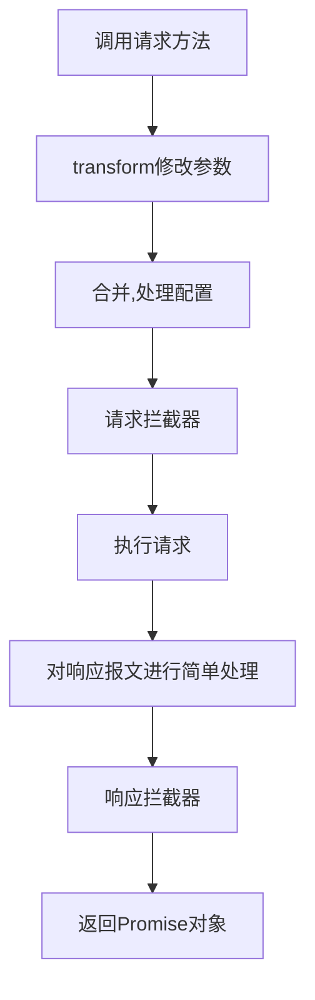

大家好，我是小小蒙，准大三，非正式前端

axios，一个用于网络请求的库，这应该是绝大多数前端项目都会用到的库了。最开始我们可以按照官方文档上的教程，直接引入调用即可。

但而随着我们项目规模的庞大，直接使用axios已经不能满足我们的需求了。毕竟谁也不想在业务层里写一大坨网络请求的代码，或者当项目上线时把上百个接口的测试环境地址一个一个改为生产环境地址。如果后端配置了token或者auth,在每个接口上一个一个添加更是一场灾难


因此，面对庞大的项目，封装axios是我们必须要做的一件事情，今天我就来带大家，封装一个功能完整的axios


## 直接使用axios存在的问题？

在进行封装之前，我们必须明确，在项目中直接使用axios中存在哪些问题或者不足，这样才能对症下药

我稍微总结了一下，将axios直接在项目中使用的问题大概有这么几个：

* 请求代码分散在业务层，无法集中管理
* 对于token，auth，timeout，baseurl这些配置无法统一设置
* 每次拿到响应报文后需要response.data获取后端传过来的数据
* 无法区分开发和生产环境，导致当环境变化时需要手动更换接口
* 当请求方式不是默认请求头时，需要手动添加请求头配置
* 使用formData,urlencoded类型参数需要做额外处理
* 没有统一错误处理机制
* 当用户连续进行请求时，会消耗大量性能并可能导致信息提交重复
* 请求过程中没有给用户反馈，用户体验不好
* 请求失败后无法进行重连
* ....

那么，我们的封装就应该着眼于解决上面的这些问题

## 封装的功能

针对上面的问题，我们就可以分析出解决的方式,并得出最后封装出的功能：
* 将api抽离，分离业务层和请求层
* 设置了统一配置并区分开发生成环境
* 添加了请求，响应拦截器，直接返回响应信息的 data
* 对各种类型的错误进行了统一处理
* 自动取消短时间内发出的连续请求
* 统一参数配置，不论是json,formdata还是urlencoded，我们data都只需要传一个对象即可
* 根据参数配置请求头
* 在请求响应前添加loading动画，优化用户体验
* 支持重连机制

需求明确了，我们直接来吧！

完整源码的项目地址：

* gitee:[Handy-Vue-cli: 对Vue脚手架的二次封装 (gitee.com)](https://gitee.com/yan-taomeng/vue-cli)
* github:[Handy-Vue-Cli: 一款更便利的，开箱即用的Vue3脚手架 (github.com)](https://github.com/SalengNotLittleMeng/Handy-Vue-Cli)

这个项目是我对于Vue脚手架的一个封装，目的是整出一个开箱即用的Vue3脚手架。本文中相关的源代码在src/api文件夹下

## 抽离api
首先我们要做的，是将所有api从业务代码中抽离出来统一管理，这样无论我们之后是要修改接口还是调试都很清晰简单。因为很多时候一个接口要用在多个地方，而如果这个接口需要修改，我们只需要修改一处即可，避免了一个接口有改动，必须翻遍项目把所有用到这个接口的地方都该一遍的问题。

那么我们应该如何将api抽离出来呢？考虑到我们之后还要去做其他封装，因此我们首先可以写一个函数,将参数从函数里传进去，并在函数内部调用axios方法。最后将这个函数暴露出去，之后每个模块只需要引入这个函数并配置参数，就可以访问使用axios的方法了


### 创建包装函数

建立http/http.js文件，在里面引入axios，然后创建一个函数，在函数内部调用axios方法，由于axios返回的是一个promise，因此我们在函数中直接return就可以了.最后，我们把这个函数暴露出去

```js
    import axios from 'axios'
    function myAxios(config) {
       return axios(config)
    }
    export default myAxios;
```
这样我们第一步就完成了！你可能会问，这样调用跟直接使用axios有什么区别吗？

别急，到这一步我们只是在axios外包装了一个函数并传参，之后我们会在这个函数中去做更多的处理。而且将这个函数暴露出去，也可以让我们的各个模块进行统一调用

那么我们现在来建立各个模块

### 对接口划分模块

在http文件夹下建立homeApi.js的文件，并引入我们刚在包装的函数，现在，我们可以在这个文件中使用刚才我们封装的函数了。我们可以写一个函数,通过给这个函数传参的方式给myAxios的参数选择中传data参数，而剩下的一些配置（比如url）我们可以直接写死在参数里，这样的话，比如我们要去请求：'http://localhost:8888/getMessage' 这个接口,只需要调用getMsg这个方法即可，并将请求所需的参数传进去即可

```js
function getMsg(params) {
  return myAxios({
    url: "http://localhost:8888/findByName",
    method: "get",
    data: params,
  });
}
```
那么我们在业务层要如何调用这个函数呢？别着急，容我细细道来。


咱们先在homeApi.js这个文件夹里做一点修改，将我们刚才定义的函数暴露出来，这个ES6语法别告诉我你不知道哦
```js
import myAxios from './http'
    export default {
     getMsg(params) {
      return myAxios({
        url: "http://localhost:8888/findByName",
        method: "get",
        params
      });
     }
}
```
之后，我们要建立一个api.js的文件，这个文件用来收集各个模块的接口并进行统一暴露

```js
import homeApi from './homeApi'

export default {
    homeApi
}
```

为什么要将一个模块先引入再暴露出去呢？看起来好像有点多此一举啊！其实这部分代码跟功能无关，而是为了**可维护性**，我们的示例中只有一个homeApi模块，但如果之后还有loginApi,admineApi,userInfoApi呢？业务中不同页面，不同功能模块的接口往往是不一样的，如果我们将所有接口都一股脑得写在一个文件里，势必会导致代码功能界限的模糊，为之后的维护造成困难，另外，各个模块的开发者共同操作一个文件，也会容易造成各种隐患。但如果我们每个功能模块暴露一个接口模块，又容易导致混淆，影响开发体验。

因此，我们采用**划分模块，统一暴露**的方式，划分开各个接口模块，但最后将他们收集在一个对象里统一暴露出去，这样就可以兼顾可维护性和开发体验了。

现在我们得到了一个里面装着各个接口模块函数的对象，只要访问这个对象并调用对应模块的函数我们就可以使用axios完成请求了。因此，最简单的方式显然是在各个模块中直接引入这个对象并调用

```js
import $http from '../../http/api'
export default {
  mounted() {
    $http.homeApi.getMsg({id:1}).then(res=>{
        console.log(res)
    })
  }
  }
```
但这样的问题是，我们每次使用都要引入这个对象，而对接口是我们在一个项目中经常会用到的部分。因此，我们完全可以将这个对象挂在Vue的实例上，当用到它的时候直接使用this进行调用
### 全局挂载
在Vue上挂载一个属性，在Vue2中我们可以直接通过操作原型链的方式进行挂载

```js
    import http from './http/http.js'
    Vue.prototype.$http=http
```

在Vue3中，Vue的config属性中给出了我们globalProperties这个对象，在这个对象上挂载属性可以通过Vue内部代理的方式，直接使用this进行访问，相对操作原型链的方式来说更加安全

```js
    import http from './http/http.js'
    const app = createApp(App);
    //将axios的二次封装（api）挂载到全局
    app.config.globalProperties.$http = api;
```

这样，我们无需每次都引入，也可以直接通过this.homeApi.getMsg({id:1})的方式进行请求，怎么样，不用引入的感觉是不少很爽？现在回头来看，我们之前将每个接口模块文件都引入然后统一暴露的方法好像也有一点瑕疵，因为每当我们添加了一个接口模块，就必须手动在api.js这个文件里引入这个模块并暴露出去，那么有没有方法可以让我们自动引入所有我们需要的模块呢？

**还真有！！！**

### 自动化引入

将一个文件夹里的文件批量引入，是webpack给我们提供的功能，这个方法叫做require.context()

这个方法可以给我们返回需要指定文件夹中每个匹配到的文件中被暴露的文件，这么说可能有点绕，但看看他的参数和返回值就会清晰很多：

-   第一个参数是一个路径字符串，表示要搜索的文件夹目录
-   第二个参数是一个布尔值，表示是否需要递归查找指定目录的所有子目录，
-   第三个参数是一个正则表达式，用来匹配文件夹中的文件名。

所以，只要给定目录和匹配方式，这个方法就会返回匹配到的每个文件中被导出的模块了吗？如果是这样，我们只需要用正则匹配这个文件夹里所有接口模块文件不就可以了吗？

我们先打印一下结果：

```js
//这里匹配以Api.js结尾是因为在自己的项目规范里以Api结尾的是接口模块文件，并不绝对
let ms = require.context("./", false, /\w+Api.js$/);
console.log(ms)
```
但结果好像不太对：


所有导出的结果呢？为啥返回的是一个函数？

先别急，其实这个被返回的函数身上还有一个方法keys，执行这个方法后返回的数组就是被暴露出各个对象

```js
console.log(ms.keys())
```


现在好像是可以拿到我们匹配到的文件路径了，但是我们现在还是没有拿到这个文件暴露出来的模块啊，而且上面那个函数又是做什么的呢？

我们可以把返回的文件路径作为参数传入require.context()返回的函数中，来打印下结果：

```js
    console.log(ms(ms.keys()[0]))
```


出现了！直接返回了这个模块的所有信息，而我们需要的接口对象就在default这个属性中

原来，require.context()这个方法会返回的内容是一个函数，这个函数的参数是一个路径字符串，返回的结果则是这个路径所在的文件中暴露出模块的所有信息。而这个方法上还有一个属性keys，这个属性是一个函数，它会返回一个包含正则匹配到的所有路径字符串的数组。

有了上面这些知识，我们现在来将模块变成自动化引入应该不是一件难事了，我们可以定义一个对象，将每个文件名作为这个对象的属性名，而对应属性的值则是该文件暴露出来的模块。

```js
let ms = require.context("./", false, /\w+Api.js$/);
let modules = {};
ms.keys().forEach((item) => {
  let name = item.substring(2, item.length - 3);
  modules[name] = ms(item).default;
});
export default modules;
```
这样即使我们之后再添加接口模块，也不需要手动引入他们，只要把他们暴露出去让api.js进行自动引入即可。


## 统一配置

我们现在已经成功将所有接口都从业务层抽离了出去，同时对他们的模块进行了划分，我们现在要进行请求依然需要将所有参数都添加进去，即使这里面有很多重复的参数。因此我们这一步要做的是将统一的配置进行抽离，减小我们的代码量

### 将直接调用改为添加实例

在统一配置前，我们要做的事，是将直接用axios方法进行请求改为添加axios实例，然后利用实例进行请求

为什么要这么做？因为封装是一把双刃剑，在减小我们代码量，保证功能内聚的同时也会导致一个问题，就是在处理比较少见的情况时，过度或不合适的封装会让你不得不做更多的处理。如果我们直接在axios上进行统一设置，那么假如今后我们出现一个特殊需求（比如需要完整的响应报文信息），此时我们的封装的axios已经配置了拦截器对报文进行了处理。如果我们配置的是axios本身，就不得不在拦截器内部为了这一个方法而写一条逻辑，这与我们封装的思路显然是不符的。而我们如果封装阶段操作的是实例，就可以使用原生的axios来处理这个问题。这样就保证了兼顾统一性和变异性

因此我们先在http/http.js下创建一个实例，然后在实例上做一些基本配置
```js
let baseURL="http://localhost:8888"
const instance = axios.create({
  //基础路径
  baseURL,
  // 请求限时
  timeout: 5000,
});
```

之后修改我们封装的函数为实例调用
```js
    function myAxios(config) {
     return instance(config)
    }
```
axios.create这个方法会返回一个axios的实例，这个实例上包括了axios绝大部分方法（比如不包括create这个方法，因为禁止套娃），事实上，axios源码内部这部分非常有意思，Axios是一个构造函数，而axios是一个具有了这个构造函数所有属性和方法的函数，调用create方法就可以利用Axios上的方法来获取一个实例，这也是为什么axios可以调用方法而不是用new来创建实例的原因


那么到这一步，统一配置属性就算是结束了吗？

**还远远不够呢**

### 根据环境区分配置

为什么要根据环境区分配置？

如果你还有过做过上线项目的经历，就会发现，开发环境的接口（一般是内网穿透或后端自己的服务器），生产环境的接口（一般是统一的服务器），以及测试环境的接口（这个我还没遇到过）是不一样的。如果每次更换环境时，你都要狼狈地打开源代码去修改baseurl，那你显然不是一个足够优秀（懒）的前端


区分环境遍历的方法并不复杂，只需要用一个我们很常用的环境变量process.env.NODE_ENV，这个环境变量就是用来帮助我们区分环境的，直接添加这部分代码即可
```js
let baseURL=null
switch(process.env.NODE_ENV){
// 生产环境
    case 'production'  :
        baseURL = 'http://localhost:8888/production';
        break;
// 测试环境
    case 'test':
        baseURL = 'http://localhost:8888/test';
        break;
// 开发环境
    default:
        baseURL = 'http://localhost:8888';
}
```

### 自动在请求头上携带token

在现在前后端分离成为趋势的前提下，token代替了cookie和session,成为了运用最广泛的登录验证的方式。当我们登录成功后，后端会给我们发送一个token，之后每次请求时我们都要在请求头携带这个token来作为我们登录的凭证。这种验证方式应该是现在应用最广泛的登录方式。

如果都在配置的请求头添加token，无疑是不优雅的，因此我们可以使用拦截器的方式，每次发送请求前在请求头携带token。

那么什么是拦截器呢？说白了，它可以在请求开始前和接到响应信息前对我们的请求/响应数据进行一些加工，非常适合统一处理请求的场景

首先，我们要对axios的实例设置一个请求拦截器：

```js
instance.interceptors.request.use((config)=>{
    return config
})
```
什么是拦截器呢，简单来说，axios在一次请求中会有这么几个步骤：




拦截器的参数是一个函数，而函数的参数是一个包含了这次请求所有信息的对象。事实上，axios内部有很多为我们设置的默认配置，这些默认配置会跟我们手动传入的配置经过合并处理，最终形成一个完整的请求参数对象，而在拦截器的阶段你可以去修改这个参数对象

这里的合并处理简单来说就是用你写进去的配置去覆盖掉axios给你的默认配置，并进行一些加工，比如根据baseurl和接口参数得出完整的请求路径。

这里面的参数config，在请求拦截器中就是最终合并处理后的结果；在响应拦截器中是服务端给我们返回的响应报文对象。我们可以在这里对参数进行统一修改;最后别忘了将config给return出去，否则这些配置将会丢失，后面的流程都会失效！

那么，我们就可以在return出config前在拦截器里对它进行一些加工了，比如在这个阶段给所有请求头统一添加token

添加token的过程其实很简单：从本地读出在登录阶段保存在localStorage中的token字符串，并将它携带在请求头

那么最简单的实现如下：
```js
    //这里保存在localStorage的字段名需要跟登录时统一
   let token = localStorage.getItem('token');
    // 如果携带token
    if (token && typeof window !== "undefined") {
      //这里的Authorization是后端给你提供的字段名，一般是这个名字，但并不绝对
      config.headers.Authorization = token;
    }
```
这个过程有问题吗？貌似没有，至少实现功能是没有问题的。但有一点却被忽略了

**token可能会重名！**

#### 设置token的一些注意事项

什么意思呢？因为token是保存在浏览器本地且全局共享的，如果你保存token的键名就叫‘token’，而如果另一个网站跟你心有灵犀的程序员也恰好使用了‘token’这个字段作为保存token的键名（事实上用token这个名称保存token的情况并不少见），那么当你的用户先访问了你的网站，又去登录另一个网站，这时如果你们设置的token名一样，就会导致你设置的token被覆盖，导致用户需要重新登录的情况

用户还在奇怪呢，这网站怎么回事，怎么切了个页面就登录过期了？

这当然是小概率事件，但我们也必须重视起来，毕竟对于一些商业项目来说，每损失一个潜在客户都是在损失一笔小钱钱

那么，设置一个不容易重名的不久好了吗？比如uijfsfkasj这种毫无规律的字符串，这总不可能出现重名了吧？


这种当然不会再发生上面这种重名的问题了，但问题是，如果你使用这种命名，那么跟你协作的同学看到这种毫无意义的命名，根本无法知道你这个变量是干嘛的。当他为了搞清楚这个变量的作用而不得不读大量代码时，一定有一颗想杀了你的小心心

所以，我们该怎么处理呢？

我们知道，对于一些不想暴露在外部的内部变量或方法，我们最好的处理是进行封装，保证密封性。如果不合适封装的话，就应该使用私有变量的命名方式来命名它，告诉其他开发者这个变量是私有属性，不要轻易修改

所谓**私有变量的命名方式**，其实就是在变量前后加上两个短横杠（_），这其实是一种开发规范

另外，我们还可以加上我们的项目名(我这里就写成axios了)来进一步保证独立性，最后，我们建议的token命名是这样的：

```js
    let token = localStorage.getItem('__axiosToken__');
```

这样就可以做到兼顾变量的可读性和独立性了

但还是要说一下，在项目中直接使用localStorage依然是一个不够合适的方案，localStorage的封装有时间也会给大家讲一下（开始挖坑）

### 统一添加auth

不知道大家的项目里有没有添加接触过这个东西。

> http auth是一种基础的用户验证，原理是将`用户名:密码`[base64](https://so.csdn.net/so/search?q=base64&spm=1001.2101.3001.7020)加密后放在http的请求头部`Authorization` 发给服务器。

简单来说，就是这个接口在访问服务器前需要先做一个登录的操作，保证使用这个接口的人是“可以信赖的”（说白了就是有账号密码，可以登陆成功的），如果这个接口没有携带auth，或者账号密码错误，就会返回401告知权限不足

那么，如果后端设置了auth,前端每个请求访问都必须带上auth,这种统一处理的操作自然是要放在拦截器当中处理了,操作很简单，直接在config里设置即可

```js
instance.interceptors.request.use((config)=>{
    const auth={
    username: "admin",
    password: "password",
  }
   config.auth = auth
   ......
    return config
})
```
你可能会说，不对啊，刚才不是说要进行base64加密吗？

没错，但axios在内部会帮你完成加密这个过程，因此我们只要去设置auth这个属性就可以了，是不是很方便？

### 统一处理错误

如果我们的请求抛出了错误，我们希望在无法返回数据时给用户一些反馈。而绝大多数时候，处理错误无非是用弹窗对用户进行提示，而这个统一的操作我们完全可以放在axios内部进行统一操作。

在axios中，响应拦截器拥有两个参数：第一个参数表示如果请求成功时处理的函数，第二个参数表示请求失败时处理的函数。响应拦截器成功时的参数与请求拦截器一样，都必须将自己默认的参数return出去保证可以进行链式调用。但对于失败时的函数，我们需要手动调用Promise的reject方法来结束可能出现的链式调用

另外，由于我们在响应报文中一般会直接去data找后端返回给我们的数据，因此在响应成功的部分，我们可以直接返回response.data，这样就不用每次找数据都去找data了

拦截器的大致结构如下：

```js
    instance.interceptors.response.use(
  (response) => {
    return response.data;
  },
  (error) => {
      ...
      return Promise.reject(error);
  }
);
```

那么既然是统一错误处理，那么我们就应该主要对请求失败的函数参数进行封装，这里的请求失败又分为两种情况：

* 请求到达了后端，但产生了某些错误
* 请求由于某些原因（比如断网或者请求被拦截），未到达后端

这两种情况的区别是：第一中情况会返回响应报文，而第二种情况会直接抛错。因此，我们可以通过是否返回请求报文而区分这两种情况，那么，对上面请求错误的部分我们环境可以做出细化：

```js
  (error) => {
    let { config, response } = error;
    if (response) {
    //请求不成功但返回结果
  } else {
    //服务器完全没有返回结果（网络问题或服务器崩溃）
  }
      return Promise.reject(error);
  }
```

那么，对于这两种方法我们应该分别怎么处理呢？


#### 返回请求报文的错误
对于返回了响应报文的错误，我们可以针对不同的响应状态码来为用户返回不同的提示信息（看不懂状态码的自行反思！），这里我们引入element-plus的提示组件,当请求错误

```js
import { ElMessage } from "element-plus";
...
(error) => {
    let { config, response } = error;
  if (response) {
    //请求不成功但返回结果
    switch (response.status) {
           case 401:
        ElMessage.error("请先登录哦~");
        break;
      case 403:
        ElMessage.error("登录信息已过期~");
        break;
      case 404:
        ElMessage.error("没有找到信息");
        break;
        case 500:
        ElMessage.error("服务器好像有点忙碌哦");
        break;
        default:
         ElMessage.error("好像有点问题哦");
    }
    }
```

有问题吗？好像没有。

但是如果我们希望对一部分接口的错误信息进行更详细的描述，这种统一的处理反而会增加麻烦，因为我们的错误处理是设置在拦截器上的，就以为着如果我们想要进行个性化处理就必须在拦截器上对一部分接口进行放行，或者重新创建实例进行操作，不论哪种都会增加代码的无效的复杂度。这就是上面说的**不合适的封装会程序变的臃肿**

因此，我们需要预留一个配置让用户能自己配置反馈信息。

这里要补充一个知识，在axios中添加一些axiso不支持的配置参数，这些参数也会保留并随着请求axios进入请求拦截器，请求过程，并在报文的config参数中返回，换句话说，如果你在axios中传了一个参数，那么**如果服务端有响应，那么这个参数在axios整个声明周期中都可以被获取到**

这是因为，axios对自己默认配置和用户传入的配置，会做一个类似于Object.assign ()方法的操作，将两个配置合并成一个config。因此，你传入的配置中如果存在默认配置中不存在的参数，自然会进行保留。

当然，这个合并的过程远比合并两个对象要复杂，这里就不细说了

那么，我们完全可以在我们封装axios传入配置的阶段传入一个配置'errorText',这个配置可以在响应拦截器中用 error.config.errorText来获取到

而我们在请求时也可以通过这个请求函数的参数对这个选项进行传参：

```js
 getMsg(params) {
  return myAxios({
    url: "http://localhost:8888/findByName",
    method: "get",
    params:params.data,
    errorText:`这是自定义的错误提示文字，并且接受传参${params.errorText}`
  });
 }
```
这样一来，在处理错误请求时，我们就可以先尝试使用这个配置，如果没有填写这个配置的话，就用统一提示。

现在我们把代码修改一下：

```js
 if (response) {
    //请求不成功但返回结果
    let {errorText}=error?.config
    let errorTextDefault=''
    switch (response.status) {
      case 401:
        errorTextDefault="请先登录哦~";
        break;
      case 403:
        errorTextDefault="登录信息已过期~";
        break;
      case 404:
        errorTextDefault="没有找到信息";
        break;
        case 500:
        errorTextDefault="服务器好像有点忙碌哦";
        break;
        default:
         errorTextDefault="好像有点问题哦";
    }
    errorText=errorText?errorText:errorTextDefault
    ElMessage.error(errorText)
  } 
```
这样我们就允许用户对错误提示信息进行自定义了，增加了封装的灵活性

#### 无请求报文的错误

如果请求直接抛出错误，连响应报文都没有了，那么无非是用户断网/请求被拦截/服务器崩溃或代码下线维护了，那么这个时候，我们就要给用户一些提示，当然，我们不可能直接告诉用户我们的服务器崩了，运维的事情怎么能说崩呢？那分明是在维护！

因此，这部分的代码大概是这样的，当请求错误且无报文，先检测是否断网，如果断网了就告知用户，否则一律提示服务器在升级中,让用户对我们的产品充满期待！

```js
else {
    //服务器完全没有返回结果（网络问题或服务器崩溃）
    if (!window.navigator.onLine) {
      //断网处理，跳转404页面
      ElMessage.error("网络好像有一点问题哦~");
    }else{
       ElMessage.error("服务器升级中，请稍后再试");
    }
  }
```

那么，统一配置这部分就算是结束了

## 简化请求参数

我们知道，axios对于get请求来说，参数名是params，对于post来说则是data.同时，请求还包括了不同数据格式，比如json,formdata,urlencoded.....对于这些不同的数据格式，传入参数的方式也是不相同的，而且也要设置不同的请求头。那么，我们能不能将这些进行一个统一，不管是哪种类型，都可以统一传入一个对象，同时，根据我们请求的类型自动帮我们添加请求头。

这个想法实现起来其实很简单，别忘了，我们之前都是将参数传入myAxios这个我们自定义的函数中的，那么我们就可以在myAxios中根据这些参数做一个处理

首先，我们要保证传入的参数是一个对象，因此我们要在最外层去做一个判断

```js
function myAxios(config) {
    if (Object.prototype.toString.call(config) === "[object Object]") {
    ......
   return instance(config)
    }
    return
}
```

这里建议用Object.prototype.toString的方法，因为typeof 会将null识别为Object，instanceof则会将Array识别为Object

### 处理不同格式的参数
首先，我们要解决的第一个问题是，怎样统一不同数据格式的参数？

我们知道，常用的三种数据格式无非是json,formdata和urlencoded，那么他们作为请求数据发送的话，各自有什么要求呢？

* json,最常用的方式，需要将JS对象转化为标准的JSON对象进行传输，这一步axios内部已经帮我们完成了，也就是说，如果是JSON格式的话，我们无需自己做处理
* FormData,一般用于传输文件类型，要求我们创建一个FormData对象，然后通过这个对象的append方法向这个对象中添加键对值，最后把这个对象作为参数发送给后端,我们可以给将传入的对象通过遍历的方式来在创建这个FormData对象并添加键对值
* urlencoded，需要在传输前进行序列化处理，将对象格式化为查询参数。这个过程我们可以直接用qs这个库来完成

那么，有了上面的分析，我们只需要给我们的参数config中添加一个参数type来确定是要传输哪种参数就可以了，然后根据参数的类型来决定处理方式即可

```js
import Qs from "qs";
...
function myAxios(config){
...
switch (config.type) {
      case "json":
       //json类型axios会自动帮我们添加请求头并进行转化，无需处理
        break;
      case "formData":
        config.headers = {
          "Content-Type": "multipart/form-data",
        };
        //对于formData类型，创建一个Formdata对象并通过遍历的方式将传入的参数对象添加进去
        let params = data;
        let newParams = null;
        if (params) {
          newParams = new FormData();
          for (let i in params) {
            newParams.append(i, params[i]);
          }
        }
        //最后将这个Formdata对象作为请求参数
        config.data = newParams;
        break;
      case "urlencoded":
        config.headers = {
          "Content-Type": "application/x-www-form-urlencoded",
        };
        //对于urlencoded类型，使用QS这个库进行序列化即可
        config.transformRequest = [
          (data) => {
            return Qs.stringify(data);
          },
        ];
        break;
      default:
        break;
    }
    }
```

经过上面的处理，不论我们需要传输哪种数据格式，都只需要在config里传入一个对象类型的data参数，无需再做其他处理，也不需要去写一大串的添加请求头配置了。


![@XCCE{CU[@`H(0)Y6BI]089.jpg](https://p6-juejin.byteimg.com/tos-cn-i-k3u1fbpfcp/d9c5688aa35240f8860a2c473fa440dc~tplv-k3u1fbpfcp-watermark.image?)
### 开启默认配置
但还没完，由于我们在一个项目中大部分碰到的还是json类型的数据，因此我们应该设置一下默认配置，不然总不能每次都写一个type类型的参数吧？另外，请求方式一般post用的要多一些，我们也可以设置post为默认的请求方式，这样在请求接口函数的部分就可以少写很多配置了。而在这里我们也可以统一一下post和get的请求参数：不论用get还是post，参数字段统一使用data

使用默认配置?很简单啊，加入config里没有这个配置就把这个配置设置为默认的值呗？

```js
     config.method = method ? method : "post";
    config.type = type ? type : "json";
```
可以是可以，但太麻烦了！

如果后面有更多的默认值，难道要一条一条加代码吗？

我们可以直接写一个默认配置对象，然后跟原本的配置对象进行合并，这样之后还有什么需要添加的默认配置，只需要修改默认配置的对象即可

```
function myAxios(config) {
    if (Object.prototype.toString.call(config) === "[object Object]") {
    const defaultConfig={
        method:'post',
        type:'json'
    }
    config=Object.assign(defaultConfig,config)
    .....
     if (config.method == "get") {
      config.params = config.data;
    }
    return instance(config);
    }
    }
```

这样，我们对于请求参数的部分也算是封装完成了！

## 关于后续更新

本来打算一万字以内写完的，但好像把这些基础的部分写完，就已经八千多字了（看来我是果然够细）。因此决定临时改成上下两篇。


下篇将会包括以下内容：

* 自动取消重复请求
* 请求过程中添加加载动画
* 添加重连机制
* 将可能修改的配置进行抽离
* 配置本地代理，集成Mock
* 对代码进行重构

下篇同样会去深挖细节，如果感兴趣的话不妨点个关注，再来不迷路哦！

我是小小蒙，非正式前端，正在为成为一名正式的前端工程师而奋斗


